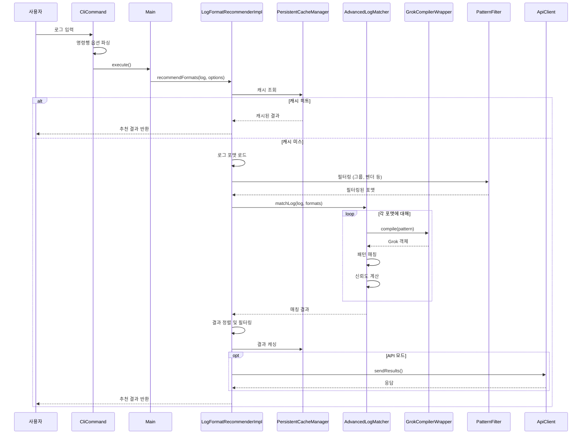
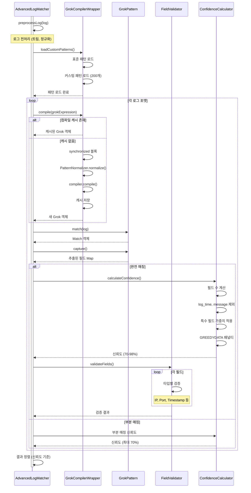
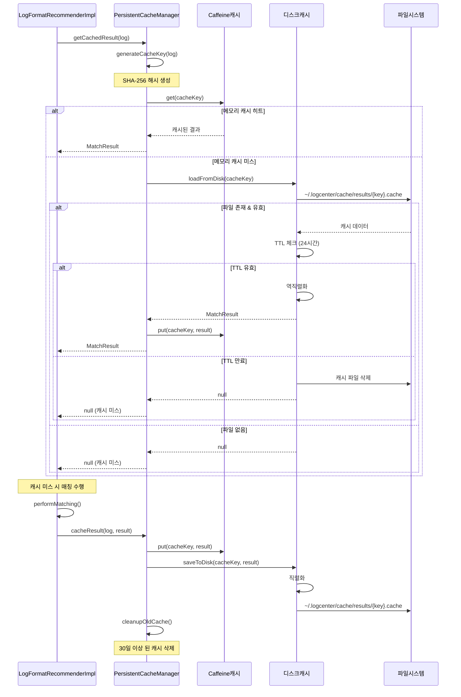
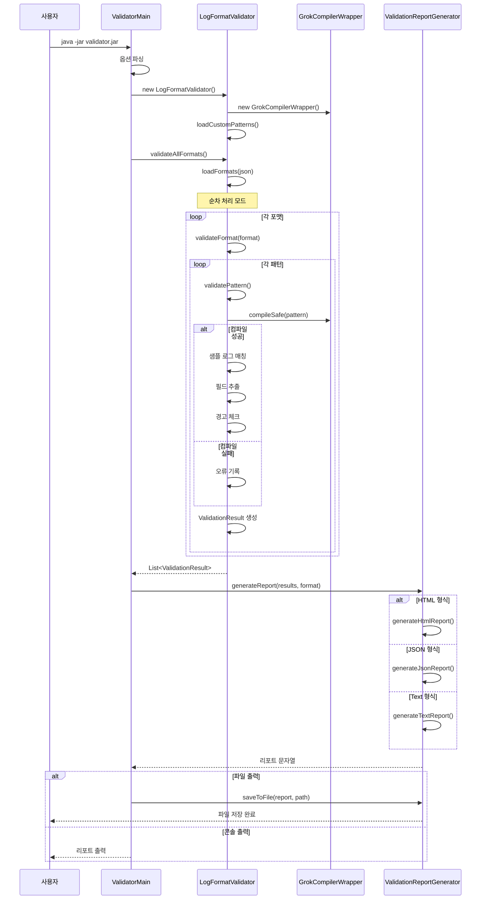
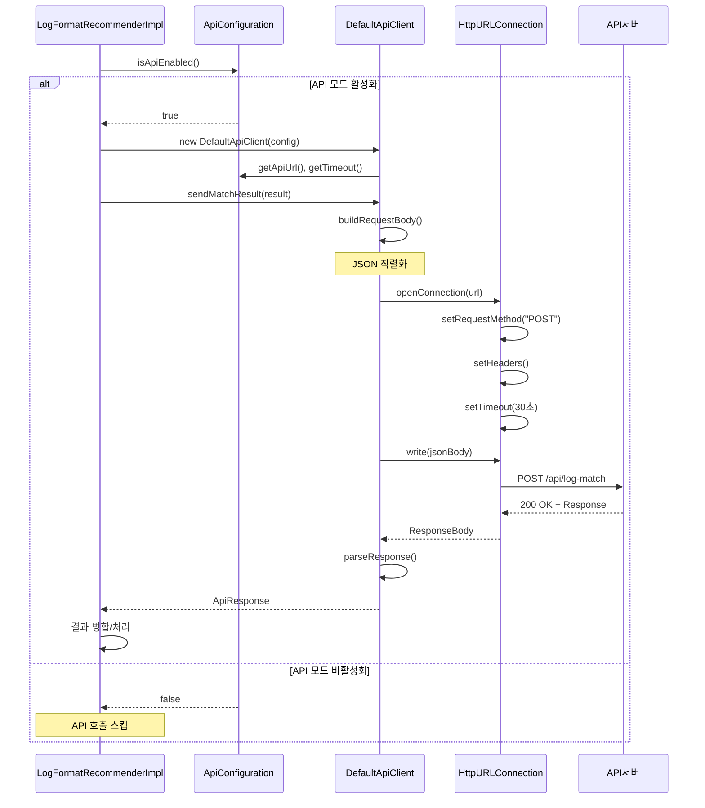

# 로그 포맷 추천 시스템 시퀀스 다이어그램

## 1. 전체 시스템 플로우

## 2. 상세 매칭 프로세스

## 3. 캐싱 메커니즘

## 4. 검증 도구 플로우

## 5. API 클라이언트 플로우

## 주요 특징

### 1. 성능 최적화
- **다층 캐싱**: 메모리(Caffeine) + 영구 캐시(디스크)
- **패턴 컴파일 캐싱**: 한 번 컴파일된 패턴 재사용
- **순차 처리**: 병렬 처리 대신 순차 처리로 타임아웃 방지

### 2. 신뢰도 계산
- 완전 매칭: 70-98% 신뢰도
- 부분 매칭: 최대 70% 신뢰도
- 특수 필드 가중치 적용
- GREEDYDATA 패턴 패널티

### 3. 확장성
- 플러그인 아키텍처 (API 클라이언트)
- 다양한 출력 형식 지원 (JSON, HTML, Text)
- 필터링 옵션 (그룹, 벤더, 신뢰도)

### 4. 안정성
- 동기화된 패턴 컴파일
- 타임아웃 방지
- 오류 복구 메커니즘